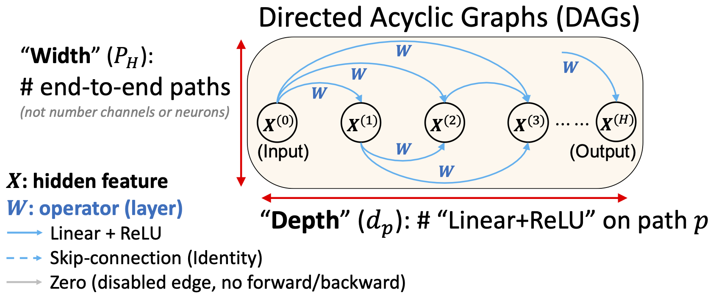

# Deep Architecture Connectivity Matters for Its Convergence: A Fine-Grained Analysis [[PDF](https://arxiv.org/pdf/2205.05662.pdf)]

<!-- [](https://lgtm.com/projects/g/VITA-Group/TENAS/context:python) -->
[](LICENSE.md)

Wuyang Chen*, Wei Huang*, Xinyu Gong, Boris Hanin, Zhangyang Wang

In Neurips 2022.

## Overview

We link the convergence rate of a network with its architecture topology (connectivity patterns), and further guide the efficient neural architecture design.

Highlights:
* We first theoretically analyze the convergence of gradient descent of diverse neural network architectures, and find the connectivity patterns largely impact their bound of convergence rate.
* From the theoretical analysis, we abstract two practical principles on designing the network’s connectivity pattern: "effective depth" $\bar{d}$ and "effective width" $\bar{m}$.
* Both our convergence analysis and principles on effective depth/width are verified by experiments on diverse architectures and datasets. Our method can further significantly accelerate the neural architecture search without introducing any extra cost.


<p align="center">
</br>
</p>


## Prerequisites
- Ubuntu 16.04
- Python 3.6.9
- CUDA 10.1 (lower versions may work but were not tested)
- NVIDIA GPU + CuDNN v7.3

This repository has been tested on GTX 1080Ti. Configurations may need to be changed on different platforms.


## Usage
### 1. `mlp_code`
This code base is for training an MLP network defined by an arbitrary DAG (directed acyclic graph) (e.g. three examples in our Figure 3).

### 2. TENAS + DAG
Modified from [TENAS](https://github.com/VITA-Group/TENAS).
On top of TENAS, we further reduce the search cost by avoid evaluating supernet of moderate depth and width.

### 3. WOT + DAG
Modified from [WOT](https://github.com/BayesWatch/nas-without-training).
On top of WOT (Neural Architecture Search Without Training), we further reduce the search cost by avoid evaluating bad architectures of extreme depth or extreme width.

## Citation
```
@article{chen2022deep,
  title={Deep Architecture Connectivity Matters for Its Convergence: A Fine-Grained Analysis},
  author={Chen, Wuyang and Huang, Wei and Gong, Xinyu and Hanin, Boris and Wang, Zhangyang},
  journal={Advances in neural information processing systems},
  year={2022}
}
```